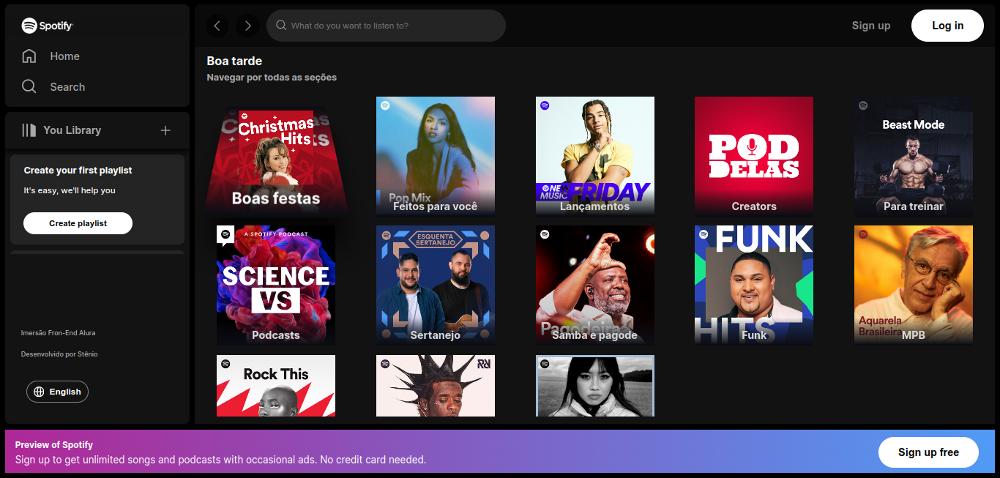
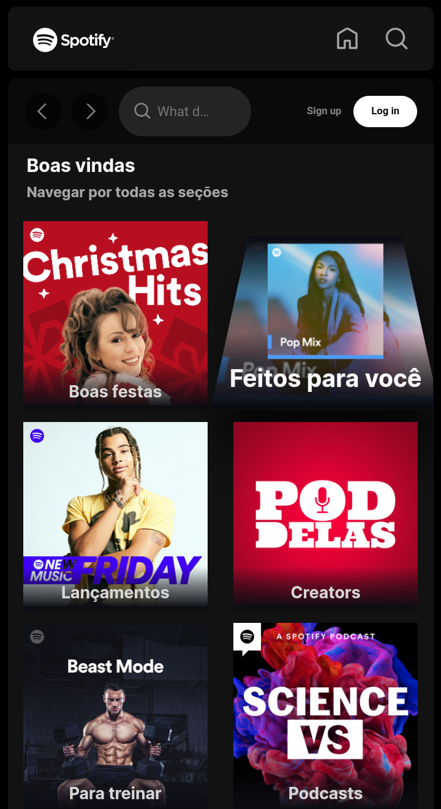

#### This is a [Next.js](https://nextjs.org/) project.

The idea behind this project is to develop a Spotify clone. The project has an educational purpose in order to foster the skills acquired in programming/development.

The project uses an internal API to obtain data such as playlists and artists.

```bash
Project developed during Immersion Frontend Alura

To access the project click on
```
#### [Project](https://spotify-nextjs-imersao-alura.vercel.app/)

##### Image in desktop format.



##### Image in mobile format.



## Deploy on Vercel

The easiest way to deploy your Next.js app is to use the [Vercel Platform](https://vercel.com/new?utm_medium=default-template&filter=next.js&utm_source=create-next-app&utm_campaign=create-next-app-readme) from the creators of Next.js.

Check out our [Next.js deployment documentation](https://nextjs.org/docs/deployment) for more details.
# Spotify-Nextjs-ImersaoAlura
